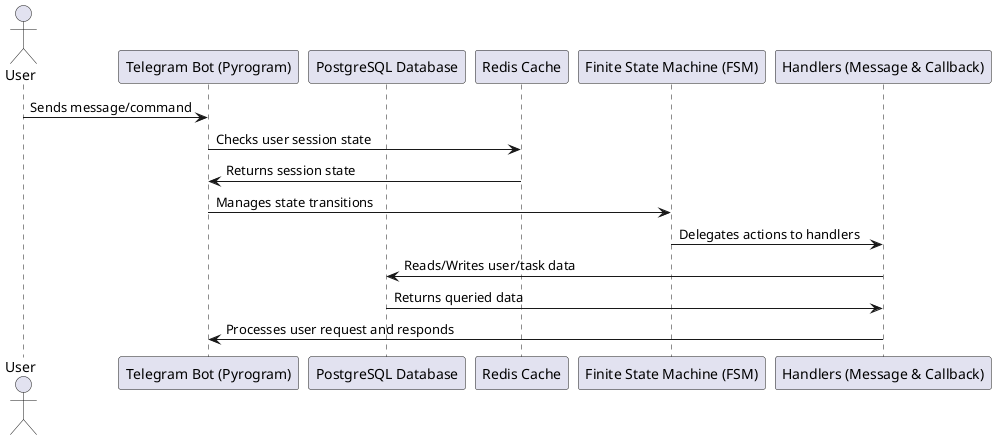
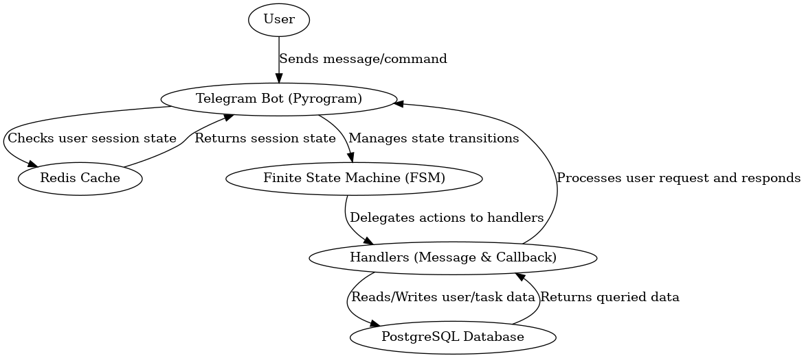

# Component Diagram and Interactions

## Overview
This document describes the component interactions of the Telegram bot, including the database, cache system, finite state machine, and message handlers.

## PlantUML Representation
Below is the PlantUML diagram that represents the interactions:

## Generated Component Diagram

## Explanation of Components
- **User (U)**: The person interacting with the bot via Telegram.
- **Telegram Bot (B)**: The main bot instance that processes messages and interactions.
- **PostgreSQL Database (DB)**: Stores user and task data persistently.
- **Redis Cache (Cache)**: Temporarily stores session data for fast access.
- **Finite State Machine (FSM)**: Manages user states during interactions.
- **Handlers (H)**: Process user commands, validate data, and interact with the database.

## Summary
This diagram illustrates how components interact to provide task management functionality for users. The FSM ensures structured user flows, while Redis optimizes session handling, and PostgreSQL stores persistent task data.

